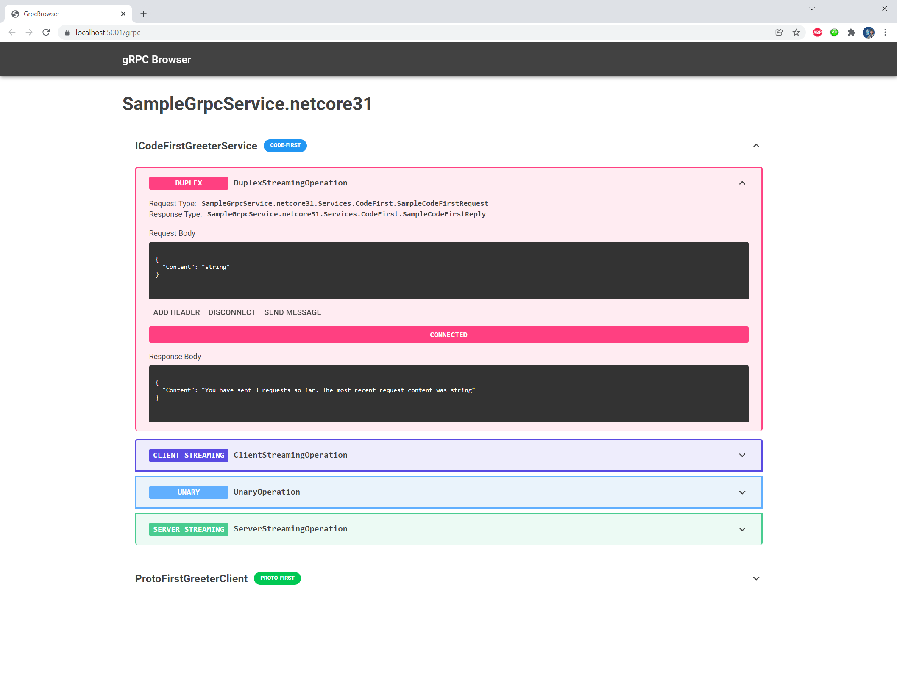

# gRPC Browser

This project allows you to add a web-based gRPC Browser for debugging purposes to your .NET application.



## Usage
1. Add the package `GrpcBrowser` from NuGet to your project
2. In the configure method of your Startup class, add `app.MapGrpcBrowser();`
3. In the configure method of your Startup class, where you call `endpoints.MapGrpcService()`, add the following:
   1. For Code-First GRPC Services: `.AddToGrpcUiWithService<ITheInterfaceOfMyCodeFirstService>()`
   2. For Proto-First (where you have defined a `.proto` file): `.AddToGrpcUiWithClient<GeneratedClientClassForMyProtoFirstGrpcService>()`

For example, the `Configure` method of a service with one proto-first and one code-first GRPC service could look like this:
```csharp
public void Configure(IApplicationBuilder app, IWebHostEnvironment env)
{
    if (env.IsDevelopment())
    {
        app.UseDeveloperExceptionPage();
    }

    app.UseRouting();

    app.MapGrpcBrowser();

    app.UseEndpoints(endpoints =>
    {
        endpoints.MapGrpcService<ProtoFirstSampleService>().AddToGrpcUiWithClient<ProtoFirstGreeter.ProtoFirstGreeterClient>();
        endpoints.MapGrpcService<CodeFirstGreeterService>().AddToGrpcUiWithService<ICodeFirstGreeterService>();
    });
}
```

4. Start your service, and navigate to `/grpc` in your browser.


