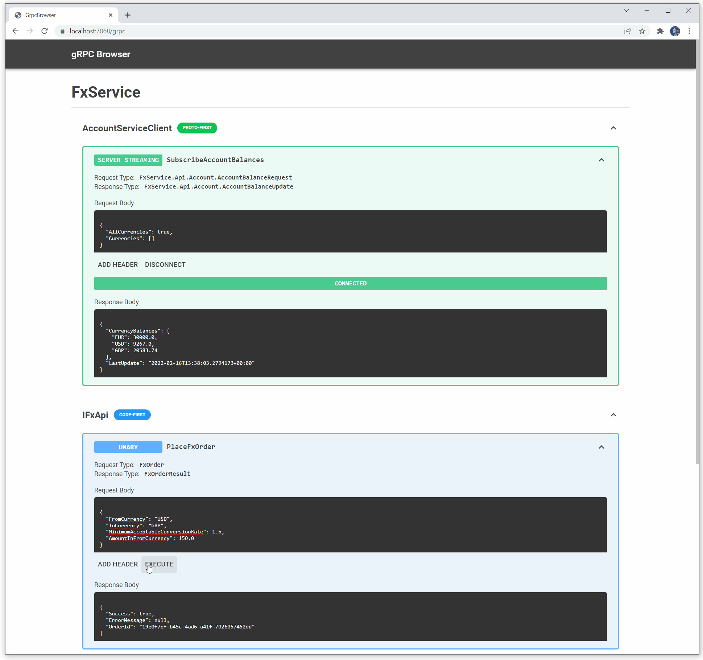

# gRPC Browser

This project allows you to add a web-based gRPC Browser for debugging purposes to your .NET application.



[Click here to view more screenshots](docs/screenshots.md)

## Features
1. Allows you to view and execute gRPC services in your .NET application
1. Supports both code-first gRPC and proto-first gRPC (with `.proto` files)
2. Does not use gRPC reflection or gRPC web
3. Support for all types of gRPC operation - Unary, Server Streaming, Client Streaming and Duplex
4. Support for Metadata
5. Support for [displaying documentation](docs/documentation.md)

### Future Roadmap
1. OAuth 2.0 support

## Usage
1. Add the package `GrpcBrowser` from NuGet to your project. Your project SDK must be Microsoft.NET.Sdk.Web (see Troubleshooting for further details).
2. In the configure method of your Startup class, add `app.UseGrpcBrowser();`
3. In the configure method of your Startup class, where you call `endpoints.MapGrpcService()`, add the following:
   1. For Code-First GRPC Services: `.AddToGrpcBrowserWithService<ITheInterfaceOfMyCodeFirstService>()`
   2. For Proto-First (where you have defined a `.proto` file): `.AddToGrpcBrowserWithClient<GeneratedClientClassForMyProtoFirstGrpcService>()`
4. In the `UseEndpoints()` setup, add `endpoints.MapGrpcBrowser()`

For example, the `Configure` method of a service with one proto-first and one code-first GRPC service could look like this:
```csharp
public void Configure(IApplicationBuilder app, IWebHostEnvironment env)
{
    if (env.IsDevelopment())
    {
        app.UseDeveloperExceptionPage();
    }

    app.UseRouting();

    app.UseGrpcBrowser();

    app.UseEndpoints(endpoints =>
    {
        endpoints.MapGrpcService<ProtoFirstSampleService>().AddToGrpcBrowserWithClient<ProtoFirstGreeter.ProtoFirstGreeterClient>();
        endpoints.MapGrpcService<CodeFirstGreeterService>().AddToGrpcBrowserWithService<ICodeFirstGreeterService>();

        endpoints.MapGrpcBrowser();
    });
}
```

5. In the `ConfigureServices` method of your Startup class, add `services.AddGrpcBrowser()`

6. Start your service, and navigate to `/grpc` in your browser.

[Click here for information on displaying documentation](docs/documentation.md)

## Troubleshooting

Example projects for .NET Core 3.1, .NET 5.0 and .NET 6.0 can be found in the `/src` folder.

### Error when navigating to `/grpc`
Make sure that your service SDK type is Microsoft.NET.Sdk.Web. This is required because GrpcBrowser adds server-side Blazor to your project. In the `.csproj` file, set the Project Sdk like this: `<Project Sdk="Microsoft.NET.Sdk.Web">`

## Implementation Detail
The service reflects over the types provided to `AddToGrpcBrowserWithClient` or `AddToGrpcBrowserWithClient` in order to determine the available operations, meaning that gRPC reflection is not required. Because we use server-side Blazor, the request execution is done from the server, meaning that gRPC web is not required.