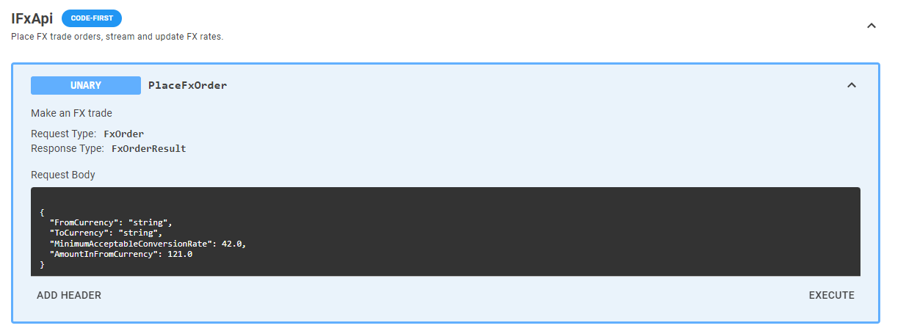
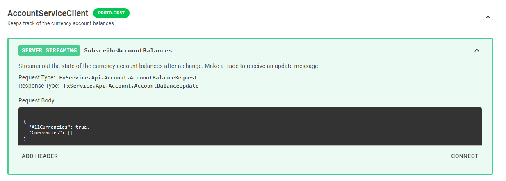

# Displaying Documentation
Both code-first and proto-first services support documentation. To enable documentation, your project will need to be setup to output documentation as XML. This can be done by adding this to the project file:
```xml
<PropertyGroup>    
  <GenerateDocumentationFile>true</GenerateDocumentationFile>
</PropertyGroup>
```

Once XML documentation has been generated, gRPC Browser will pick it up and display it.

## Examples

### Code-First

A service interface with the following summary comments on the interface and method:

```csharp
/// <summary>
/// Place FX trade orders, stream and update FX rates.
/// </summary>
[Service]
public interface IFxApi
{
    /// <summary>
    /// Make an FX trade
    /// </summary>
    [Operation]
    Task<FxOrderResult> PlaceFxOrder(FxOrder request, CallContext context = default);
```

Gets displayed like this:


### Proto-First

A proto file with the following comments above the service and operation:

```proto
// Keeps track of the currency account balances
service AccountService {
  // Streams out the state of the currency account balances after a change. Make a trade to receive an update message
  rpc SubscribeAccountBalances (AccountBalanceRequest) returns (stream AccountBalanceUpdate);
}
```

Gets displayed like this:
