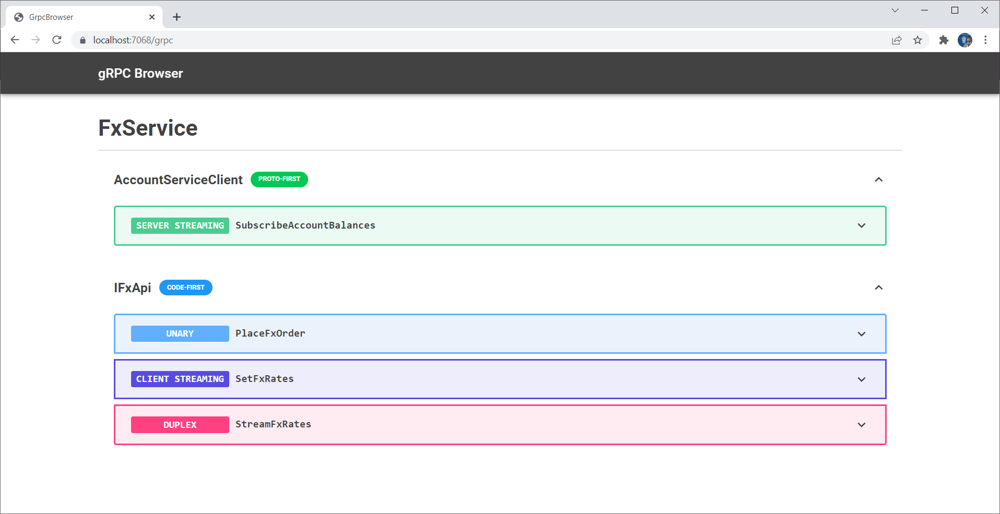
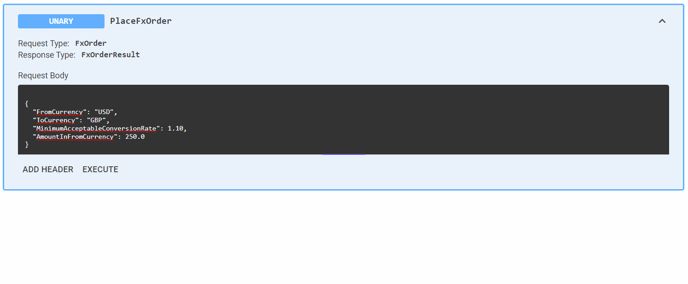
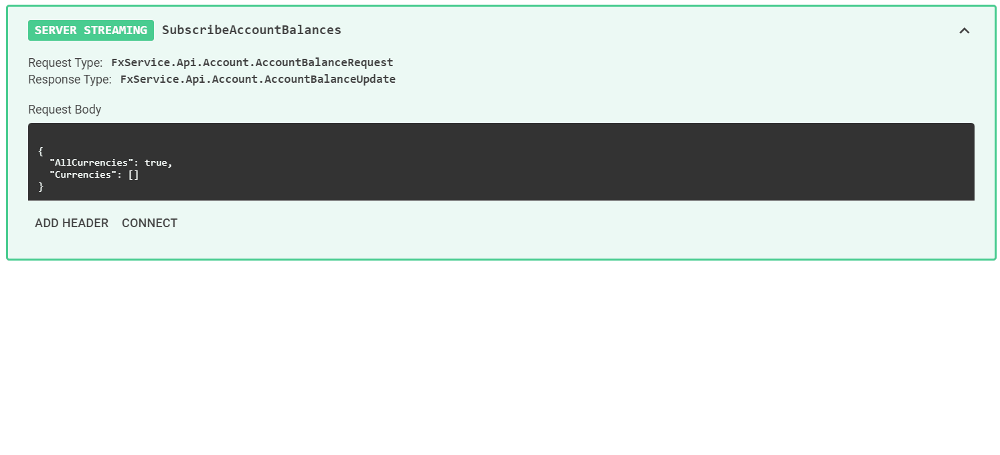
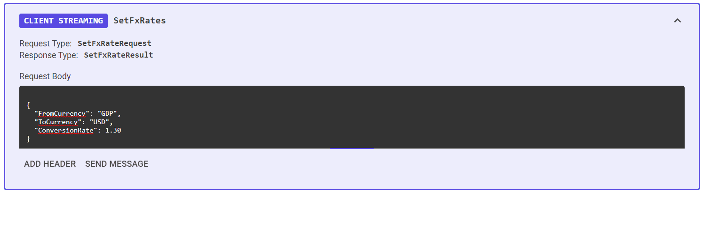
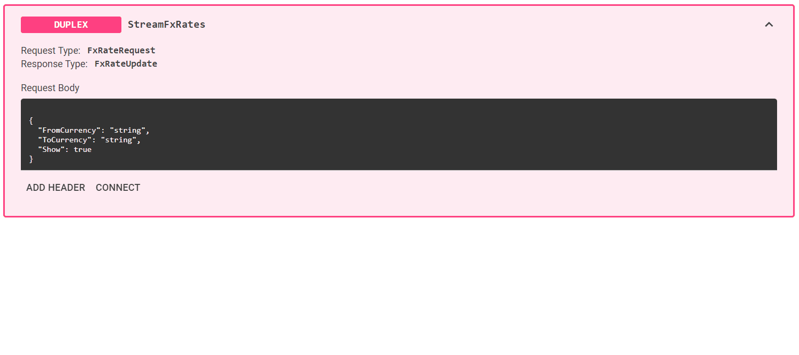

# gRPC Browser Screenshots

## Overview
This is how gRPC Browser looks for the [example FxService](../src/Samples/FxService/).

Each registered gRPC service is listed, and when expanded, each operation in that service is shown with the operation type and its name.

Below are examples of how each operation type can be used in gRPC Browser.

## Unary

For a unary operation, the request body is shown and can be modified, and pressing execute will display the response body below.

## Server Streaming

For a server streaming operation, an initial request body is sent, and then a stream of responses are received from the server. Note that the first response may not necessarily come immediately, in which case no response body will be shown.

## Client Streaming

For a client streaming operation, the client (gRPC browser in this instance) sends a stream of messages to the service. A response from the service will only be received on disconnection, and in this example is an empty response.

## Duplex

For a duplex operation, both the client and the server stream messages to each other. Once connected, gRPC browser allows you to send messages to the service, and will display the latest streamed message from the service.